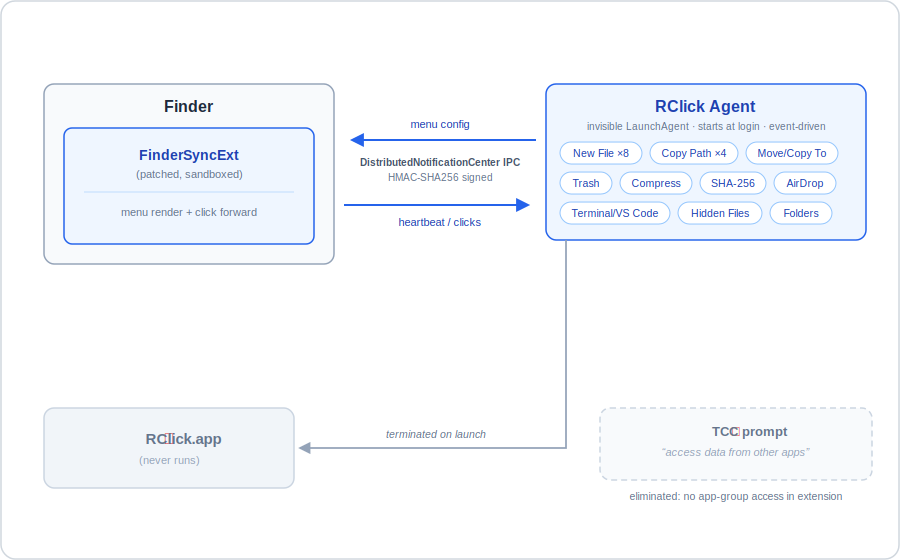
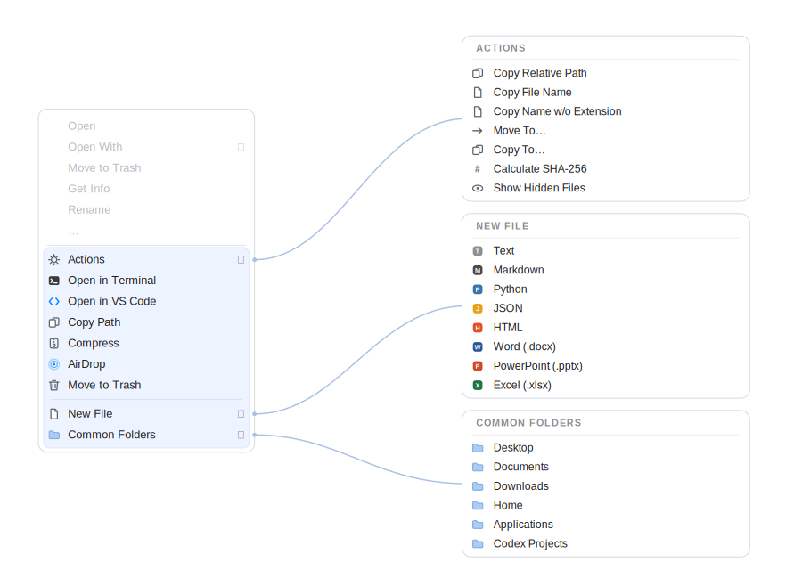

# RClick Agent — prompt-free edition

A fork of [wflixu/RClick](https://github.com/wflixu/RClick) that fixes the recurring macOS 15+ *“RClick” would like to access data from other apps* prompt, and replaces the RClick main app with an invisible, event-driven LaunchAgent that drives a Windows-style right-click menu in Finder.





## Why this fork exists

On macOS 15 and later, stock RClick re-asks for “access data from other apps” permission after every Finder restart, login, or reboot — and neither *Allow* nor *Don’t Allow* sticks. This fork removes the root cause, and additionally replaces `RClick.app` with a windowless LaunchAgent (`RClick Agent.app`) so nothing shows up in the Dock or menu bar.

## Differences from upstream

### 1. Fix: the recurring “access data from other apps” prompt

**Root cause.** The FinderSync extension (`cn.wflixu.RClick.FinderSyncExt`) reads `UserDefaults(suiteName: "group.cn.wflixu.RClick")` in `Shared/AppLocalization.swift` when it builds its first menu. macOS 15+ requires app-group identifiers to be team-ID-prefixed; a non-conforming suite name is treated as cross-app data access and triggers a TCC `SystemPolicyAppData` consent dialog. macOS never persists that decision for this case — neither answer sticks — so every fresh extension process (every Finder restart, login, or reboot) prompts again.

**Fix.** The extension no longer uses an app-group suite at all. It reads a plain defaults domain, `prefs.cn.wflixu.RClick`, which involves no cross-app data access and therefore no prompt. (Trade-off: a language override set in the RClick app no longer reaches the extension, which falls back to the system language — irrelevant when the agent below replaces the app entirely.)

**Two ways to get the fix:**

- **Build from this fork** — the source change is already in place.
- **Byte-patch an installed Developer-ID copy** — the fix is a same-length string swap inside the appex binary (`group.cn.wflixu.RClick` → `prefs.cn.wflixu.RClick`), followed by an ad-hoc re-sign of the extension. This is what runs on the author’s machine. It invalidates the Developer-ID signature of the extension, so Gatekeeper caveats apply; do this only if you understand the tradeoff.

### 2. Fix: PermissionChecker no longer trips the same prompt

Upstream’s Full-Disk-Access check probed `~/Library/Mail`, `~/Library/Messages`, and `~/Library/Safari` — reads that fire the same App Data prompt the moment `RClick.app` launches. The check now probes the TCC databases instead (FDA-gated, silently denied without FDA, never prompts), using a directory listing only.

### 3. New: `rclick-agent/` — an invisible LaunchAgent replacing the main app

`RClick Agent.app` (bundle id `dev.zwk.rclick-agent`, installed to `~/Applications/RClick Agent.app`) is a windowless LaunchAgent that takes over the main app’s job entirely:

- Feeds menu configuration to RClick’s FinderSync extension over `DistributedNotificationCenter`, with HMAC-SHA256-signed payloads so the extension only accepts config from the agent.
- Executes **all** menu actions itself:
  - New file (8 templates, including Office documents)
  - Copy path (several variants)
  - Move / Copy to… (folder picker)
  - Move to Trash
  - Compress
  - SHA-256 checksum
  - AirDrop
  - Open in Terminal / VS Code
  - Show/hide hidden files toggle
  - Jump to common folders
- Shows no windows except the Move/Copy folder picker and the AirDrop sheet.
- Starts at login (`RunAtLoad`, Aqua session), auto-restarts only on crash (`KeepAlive` with `SuccessfulExit=false`), handles `SIGTERM` for a clean `launchctl bootout`.
- Terminates `RClick.app` if it ever launches, via an `NSWorkspace.didLaunchApplicationNotification` observer.
- Ships with `build.sh` / `install.sh` / `uninstall.sh` and a test CLI that impersonates the extension for debugging.

## Install

**Prerequisite:** RClick's FinderSync extension must be present and enabled — either build this fork's `RClick.app` with Xcode 16+, or install the upstream [v2.0.4 release](https://github.com/wflixu/RClick/releases) into `/Applications` and apply the byte-patch described above.

The agent itself requires only the Xcode **Command Line Tools** — no full Xcode.

```sh
cd rclick-agent
./build.sh
./install.sh
```

`install.sh` copies `RClick Agent.app` into `~/Applications`, installs the LaunchAgent plist, and bootstraps it into your login session. Then enable the RClick extension in **System Settings → General → Login Items & Extensions → Finder extensions** if it isn’t already.

## Permissions

- **File access.** The agent is ad-hoc signed, so macOS asks once per protected folder (Desktop, Documents, Downloads) the first time an action touches it. These prompts *do* persist. Alternatively, grant the agent **Full Disk Access** once and skip the per-folder prompts.
- **Accessibility (optional).** Granting Accessibility lets the agent select the filename for editing right after “New file”, matching Windows behavior. Everything else works without it.
- No other permissions are requested. The “access data from other apps” prompt is gone by design (see above).

## Power and efficiency

The agent is strictly event-driven — no timers, no polling loops.

- The FinderSync extension heartbeats every 10 s (macOS typically runs two extension processes); the agent replies **only** when menu content actually changed (in practice: the hidden-files label flipping between show/hide).
- An independent power audit of the agent and its LaunchAgent configuration found no further wins: launchd `ProcessType` demotion, QoS lowering, and heartbeat suppression would each hurt click-to-action latency or reliability while saving nothing at idle.
- Measured on the author’s machine: **0.28 s total CPU over 52 min uptime**, **32 MB RSS**, **0.0 %CPU when idle**.

## Known limitations

- **No menu in iCloud-synced folders.** FinderSync extensions cannot inject menus into FileProvider-backed windows (iCloud Drive, Desktop & Documents sync). This is an OS restriction, not fixable here.
- **Updating RClick from upstream re-introduces the prompt.** A new upstream build restores the app-group read in the extension; you must re-apply the source fix or re-do the byte-patch after any update.

## Troubleshooting

**Menu shows “RClick (loading…)”** — the extension hasn’t heard from the agent. Restart the agent and Finder:

```sh
launchctl kickstart -k gui/$(id -u)/dev.zwk.rclick-agent
killall Finder
```

**Inspect agent logs:**

```sh
log show --last 30m --predicate 'subsystem == "dev.zwk.rclick-agent"'
```

**Debug the config channel** without touching Finder using the bundled test CLI in `rclick-agent/`, which impersonates the extension’s heartbeat and prints the signed config the agent sends back.

## Uninstall

```sh
cd rclick-agent
./uninstall.sh
```

This boots the LaunchAgent out of your session, removes the plist, and deletes `~/Applications/RClick Agent.app`. Disable the Finder extension in System Settings if you’re removing RClick entirely.

## Credits and license

- Upstream project: [wflixu/RClick](https://github.com/wflixu/RClick) — all credit for the original app and the FinderSync extension goes to its author.
- This fork, like upstream, is licensed under the **GNU General Public License v3.0**. See [LICENSE](LICENSE). Modified sources and the `rclick-agent/` additions are distributed under the same terms.